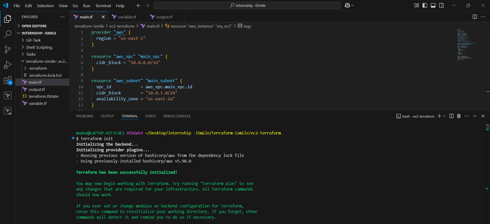
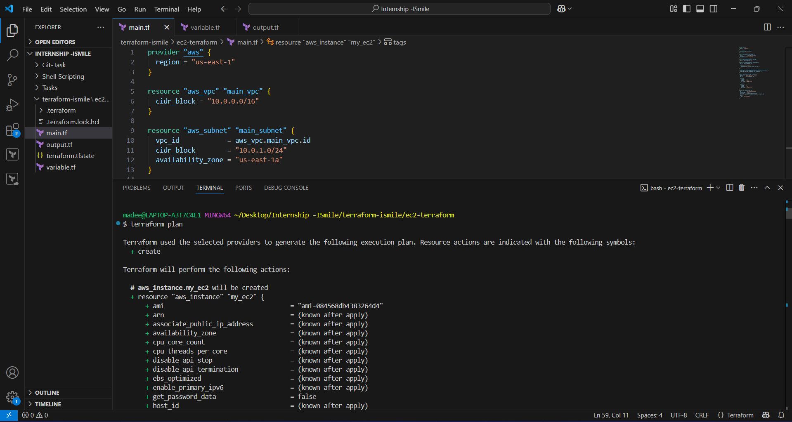
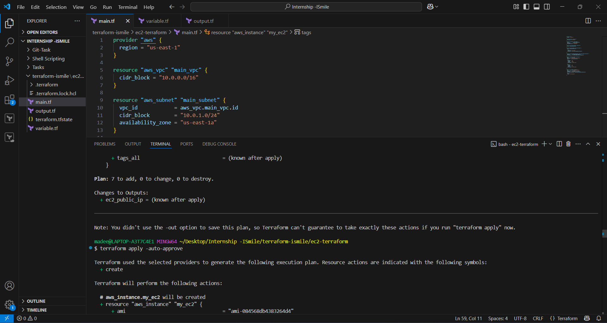
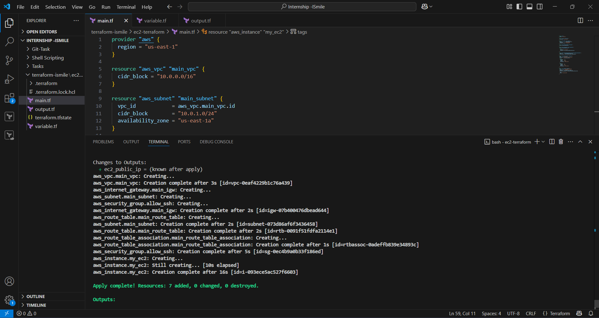
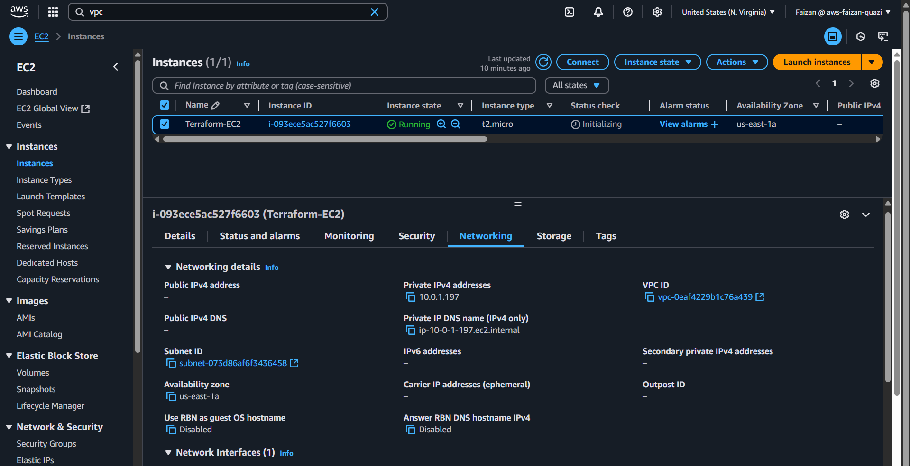

# Initializing EC-2 using terraform

Using Terraform (IaC) tool, we can provision infrastucture into the cloud.

## Terraform init

## Terraform plan

## Terraform apply -auto-approve

## Resource added

## Reflect on the cloud (EC-2 instance with custom VPC, subnet and security group)

